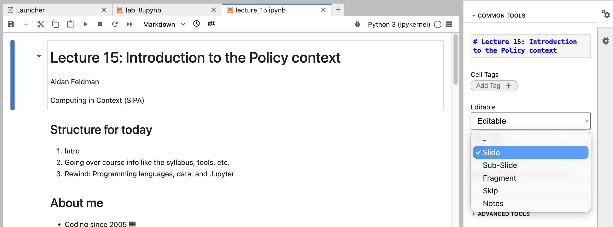

# Computing in Context course site

[](https://computing-in-context.afeld.me/?badge=latest)

Built using [Jupyter Book](https://jupyterbook.org/).

## Setup

```sh
make setup
```

## [Running the site locally](https://jupyterbook.org/stable/get-started/build-websites/#running-jupyter-book-start)

```sh
make site
```

## [Starting JupyterLab](https://jupyterlab.readthedocs.io/en/stable/getting_started/starting.html)

```sh
make lab
```

## Eleventy site for `pages/`

To browse the Markdown and notebooks in `pages/` without Jupyter Book:

```sh
npm install
# ensure the Python env with nbconvert is active
source .venv/bin/activate
export PYTHON="$VIRTUAL_ENV/bin/python"
npm run serve
```

The site will build to `_site/` and will live-reload while developing. Notebooks are converted to HTML using `nbconvert`'s built-in templates (no custom renderer required).

## Slides

### Presenting

```sh
make slides notebook=[file]
```

For example:

```sh
make slides notebook=lecture_15.ipynb
```

### Creating/editing

Most of the notebooks in this repository are also slide decks, with the Slide Type specified as cell metadata. In JupyterLab:



In general, the presentations are organized as:

- One intro Slide per topic, then Sub-Slides that go into details
- Slides have an H2, while Sub-Slides have an H3+

Easiest to understand this by viewing the presentation.

## Merging notebooks

[nbmerge](https://github.com/jbn/nbmerge?tab=readme-ov-file#usage) seems to be easier than copying across them.
