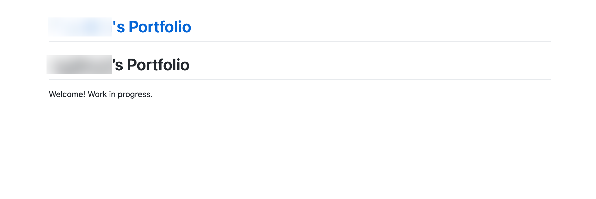
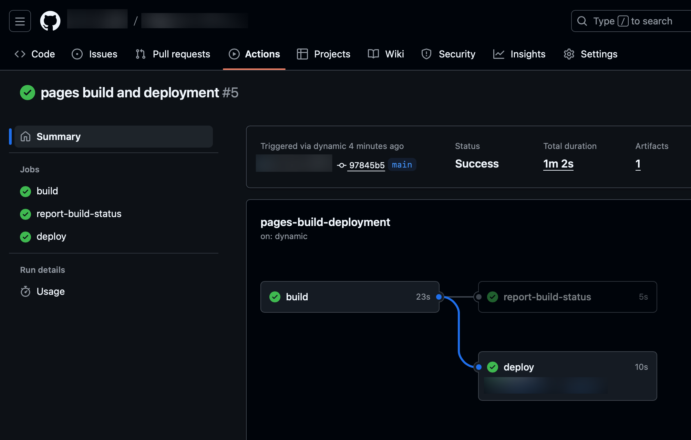

# Notebooks

## General guidance

- This site is built from Jupyter notebooks and Markdown files using [Jupyter Book](https://jupyterbook.org/). You can take a look at [the source code](https://github.com/afeld/computing-in-context), if curious.
- Labs are structured, while [Projects](projects.md) are more open-ended. Both are meant to be challenging, but not impossible.
  - Try and work through problems on your own to start. If you are stuck for more than a half hour, [step away](https://dankim.org/posts/cant-crack-that-programming-problem/). If you _still_ can't figure it out, ask for help.
    - [Ed](https://courseworks2.columbia.edu/courses/230821/external_tools/37606?display=borderless)
    - [Office hours](office_hours.md)

## Downloading notebooks

For lecture slides / labs, download the page as a notebook to work with it locally.

1. Open the page for the Homework/Lecture on this site.
   - For example: [Lab 9](lab_9.ipynb)
1. Hover over the download icon (⬇️) in the toolbar at the top.
1. Click `.ipynb`.
1. Feel free to move the file wherever you like.
1. Open the notebook in VSCode.

That is now your own copy; you can execute/add cells as you like, including adding your own notes in [Markdown cells](https://jupyter-notebook.readthedocs.io/en/stable/examples/Notebook/Working%20With%20Markdown%20Cells.html). For Labs, the intention is for you to turn in the template via Gradescope, filled in with your code.

```{warning}
Images will be broken in downloaded notebooks.
```

## Activate the environment

(in the Terminal)

1. [Open the working folder in VSCode.](https://code.visualstudio.com/docs/getstarted/getting-started#_open-a-folder-in-vs-code)
1. [Open a terminal in VSCode.](https://code.visualstudio.com/docs/terminal/getting-started)
1. [Activate the environment](https://docs.python.org/3/library/venv.html#how-venvs-work), if it isn't already.
   - Mac: `source .venv/bin/activate`
   - Windows (PowerShell): `.venv\Scripts\Activate.ps1`
     - Get an execution policy error? See [the Note in the `venv` documentation](https://docs.python.org/3/library/venv.html#creating-virtual-environments:~:text=On%20Microsoft%20Windows,%2DScope%20CurrentUser), then retry.

It should then show `(.venv)` at the beginning of your terminal prompt.

## Installing packages

This will need to be done any time you add packages. Avoid using `pip install [package]`.

1. [Activate the environment.](#activate-the-environment)
1. Add packages to a [`requirements.txt`](https://pip.pypa.io/en/stable/reference/requirements-file-format/) file.
1. Install the packages.

   ```sh
   pip install -r requirements.txt
   ```

## Common issues

### [Jupyter in VSCode](https://code.visualstudio.com/docs/datascience/jupyter-notebooks)

[This was set up in Lecture 16.](lecture_16.ipynb#lab-8-prep)

We've run into issues with being unable to [select the kernel](https://code.visualstudio.com/docs/datascience/jupyter-notebooks#_create-or-open-a-jupyter-notebook). Try each of the following:

- Ensure you're on the latest versions of:
  - [VSCode](https://code.visualstudio.com/docs/setup/setup-overview#_update-cadence)
  - [The extensions](https://code.visualstudio.com/docs/configure/extensions/extension-marketplace#_extensions-view-filter-and-commands)
- Restart VSCode (quitting the full app, not just the window).
- [Mac: "The application is on a read-only volume."](https://stackoverflow.com/a/65422671/358804)
- Confirm that [the packages were installed in the virtual environment](#installing-packages), not [globally](https://packaging.python.org/en/latest/tutorials/installing-packages/#creating-virtual-environments).

### [Jupyter Book](https://jupyterbook.org/)

[This was set up in Lab 8.](lab_8.ipynb#jupyter-book)

- **`Jupyter command `jupyter-book` not found.`:**
  1. [Activate the environment.](#activate-the-environment)
  1. Double-check you've done [the install](lab_8.ipynb#install).
- **Plotly visualizations aren't appearing:**

  1. Add the following to the top of your notebook:

     ```python
     # ensure the visualizations render properly across VSCode, Jupyter Book, etc.
     # https://plotly.com/python/renderers/

     import plotly.io as pio

     pio.renderers.default = "notebook_connected+plotly_mimetype"
     ```

  1. Re-run your notebook.

#### Not displaying properly

If your published site looks like this:



_No navigation, search, etc._

and you see a `pages-build-deployment` under your [Actions](https://docs.github.com/en/actions/how-tos/monitor-workflows/view-workflow-run-history):



1. Go through [the instructions](https://jupyterbook.org/stable/get-started/publish/#github-pages) again.
1. [Commit](lab_8.ipynb#commit) and push a change.
   - It can be small.
1. After build, confirm your site has navigation similar to this:

   

## Submission

You will submit via [Gradescope](https://courseworks2.columbia.edu/courses/230821/external_tools/29680?display=borderless).

- [Lab 8](lab_8.ipynb): Submit the URL to your [portfolio site](lab_8.ipynb) (`https://[username].github.io/`).
- [Projects](projects.md):
  1. Add the notebook to your [portfolio site](lab_8.ipynb).
     1. Add to the [table of contents](https://jupyterbook.org/stable/authoring/table-of-contents/).
     1. [View the page locally.](https://jupyterbook.org/stable/get-started/build-websites/)
     1. Push the page.
     1. Confirm it appears at `https://[username].github.io/project_[n].html` (or similar).
  1. Submit the link to the new page (like `https://[username].github.io/project_[number].html`).
- Other Labs: Upload your notebook.
  - You can ignore Gradescope saying "Large file hidden". The TAs can download the notebook to view.
  - [Gradescope limits submissions to 100MB.](https://guides.gradescope.com/hc/en-us/articles/21861529742477-File-Requirements-for-Assignment-Types#h_01HGKC7CC57Q7MMHMYJ5G6F80E) If you're unable to submit for this (or any other) reason, [reach out to the TAs](index.md#teaching-assistants-tas).

```{caution}
Please do not include your Lab notebooks in your site, per the [Academic Integrity Policy](index.md#academic-integrity).
```
